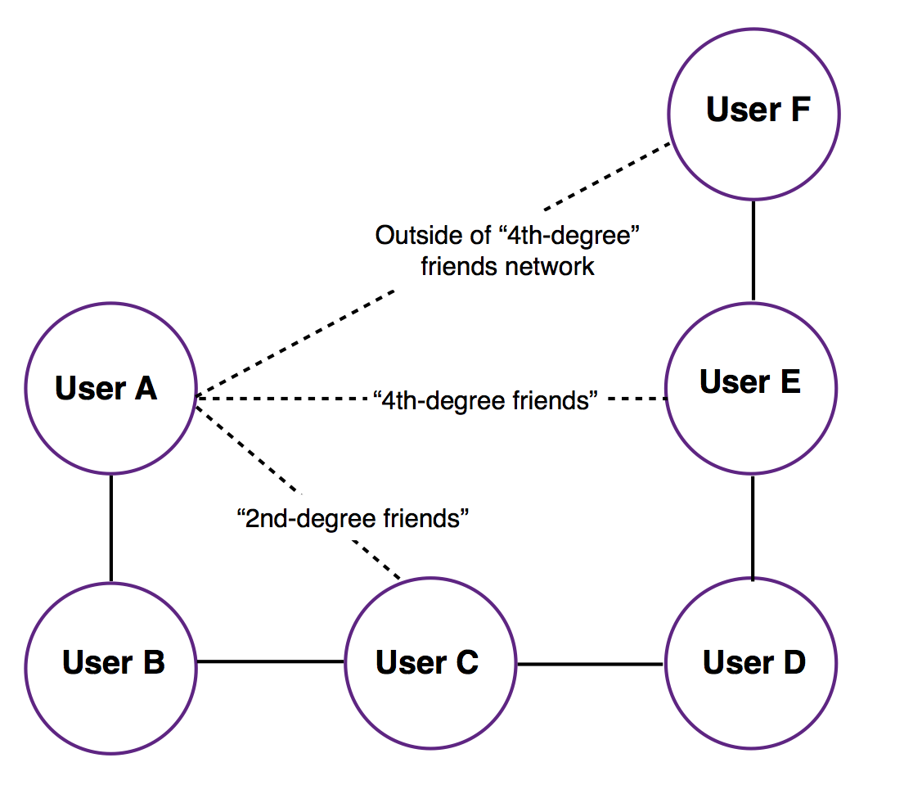

# Table of Contents

1. [Fraud Detection](README.md#challenge-summary)
2. [Details of Implementation](README.md#details-of-implementation)
3. [Description of Data](README.md#description-of-data)
5. [Repo directory structure](README.md#repo-directory-structure)
6. [Testing your directory structure and output format](README.md#testing-your-directory-structure-and-output-format)

## Challenge Summary

A "digital wallet" company called PayMo that allows users to easily request and make payments to other PayMo users. The team at PayMo has decided they want to implement features to prevent fraudulent payment requests from untrusted users. 

### Feature 1
When anyone makes a payment to another user, they'll be notified if they've never made a transaction with that user before.

* "unverified: You've never had a transaction with this user before. Are you sure you would like to proceed with this payment?"

### Feature 2
The PayMo team is concerned that these warnings could be annoying because there are many users who haven't had transactions, but are still in similar social networks. 

For example, User A has never had a transaction with User B, but both User A and User B have made transactions with User C, so User B is considered a "friend of a friend" for User A.

For this reason, User A and User B should be able to pay each other without triggering a warning notification since they're "2nd degree" friends. 

To account for this, PayMo would like you to also implement this feature. When users make a payment, they'll be notified when the other user is outside of their "2nd-degree network".

* "unverified: This user is not a friend or a "friend of a friend". Are you sure you would like to proceed with this payment?"

### Feature 3
More generally, PayMo would like to extend this feature to larger social networks. Implement a feature to warn users only when they're outside the "4th degree friends network".

In the above diagram, payments have transpired between User

* A and B 
* B and C 
* C and D 
* D and E 
* E and F

Under this feature, if User A were to pay User E, there would be no warning since they are "4th degree friends". 

However, if User A were to pay User F, a warning would be triggered as their transaction is outside of the "4th-degree friends network."

(Note that if User A were to pay User C instead, there would be no warning as they are "2nd-degree" friends and within the "4th degree network") 

## Details of implementation

This implementation uses graphs to build a network of users and then uses BFS to implement the feature of 'friend of friend'. 
The graph is first built based on the input file `/paymo_input/batch_payment.txt`.

In the next step, for each transaction read from `/paymo_input/stream_payment.txt` the relationship between the users are determined using
BFS on the previously built graph.

### How to run the code

Clone this repository. To clone, from your terminal type:

 `~$git clone https://github.com/niladri18/digital_wallet.git`

Once the download is complete, you will see a folder named `digital_wallet` in your local repository.
Enter into the `/digital_wallet`. The input files can be found in `/paymo_input`. 
Place the two desired input files in `/paymo_input`. The input files should be named as `batch_payment.txt` and `stream_payment.txt`.  

Now with `/digital_wallet` as your working directory, from your terminal type the following:

`/digital_wallet$bash run.sh`

### Viewing the output

Once the execution is complete, the output can be viewed in `/paymo_output` folder. Inside this folder, three output files will be generated.

`output1.txt` will have results from feature 1.

`output2.txt` will have results from feature 2.

`output3.txt` will have results from feature 3.

For more details of input and viewing the output and the repository structure, see below.

### Input

Ideally, payment data would come from a real-time, streaming API, but this project does not deal with "DevOps" of connecting to an API.

As a result, I have assumed that collecting the payments has been done and the data resides in two comma-delimited files in the `paymo_input` directory. 

The first file, `batch_payment.txt`, contains past data that can be used to track users who have previously paid one another. These transactions are used to build the initial state of the entire user network.

Data in the second file, `stream_payment.txt` is used to determine whether there's a possibility of fraud and a warning should be triggered.

I have assumed that each new line of `stream_payment.txt` corresponds to a new, valid PayMo payment record -- regardless of being 'unverified' -- and designed the program to handle a text file with a large number of payments. 

### Output

The code processes each line in `stream_payment.txt` and for each payment, output a line containing one of two words, `trusted` or `unverified`. 

`trusted` means the two users involved in the transaction have previously paid one another (when implementing Feature 1) or are part of the "friends network" (when implementing Feature 2 and 3).

`unverified` means the two users have not previously been involved in a transaction (when implementing Feature 1) or are outside of the "friends network" (when implementing Features 2 and 3)

The output is written to a text file in the `paymo_output` directory (see above).

For example, if there were 5 lines of transactions in the `stream_payment.txt`, then the following `output1.txt` file for Feature 1 could look like this: 

	trusted
	trusted
	unverified
	unverified
	trusted

## Description of Data

[Back to Table of Contents] (README.md#table-of-contents)

The `batch_payment.txt` and `stream_payment.txt` input files are formatted the same way.

The first line is the header. It contains the names of all of the fields in the payment record. In this case, the fields are 

* `time`: Timestamp for the payment 
* `id1`: ID of the user making the payment 
* `id2`: ID of the user receiving the payment 
* `amount`: Amount of the payment 
* `message`: Any message the payer wants to associate with the transaction

Following the header, each new line contains a single new PayMo payment record with each field delimited by a comma. In some cases, the field can contain Unicode as PayMo users are fond of placing emojis in their messages. For simplicity's sake, you can choose to ignore those emojis.

For example, the first 10 lines (including the header) of `batch_payment.txt` or `stream_payment.txt` could look like: 

	time, id1, id2, amount, message
	2016-11-02 09:49:29, 52575, 1120, 25.32, Spam
	2016-11-02 09:49:29, 47424, 5995, 19.45, Food for 🌽 😎
	2016-11-02 09:49:29, 76352, 64866, 14.99, Clothing
	2016-11-02 09:49:29, 20449, 1552, 13.48, LoveWins
	2016-11-02 09:49:29, 28505, 45177, 19.01, 🌞🍻🌲🏔🍆
	2016-11-02 09:49:29, 56157, 16725, 4.85, 5
	2016-11-02 09:49:29, 25036, 24692, 20.42, Electric
	2016-11-02 09:49:29, 70230, 59830, 19.33, Kale Salad
	2016-11-02 09:49:29, 63967, 3197, 38.09, Diner
	 

## Repo directory structure
[Back to Table of Contents] (README.md#table-of-contents)

Example Repo Structure

	├── README.md 
	├── run.sh
	├── src
	│  	└── antifraud.java
	├── paymo_input
	│   └── batch_payment.txt
	|   └── stream_payment.txt
	├── paymo_output
	│   └── output1.txt
	|   └── output2.txt
	|   └── output3.txt
	└── insight_testsuite
	 	   ├── run_tests.sh
		   └── tests
	        	└── test-1-paymo-trans
        		│   ├── paymo_input
        		│   │   └── batch_payment.txt
        		│   │   └── stream_payment.txt
        		│   └── paymo_output
        		│       └── output1.txt
        		│       └── output2.txt
        		│       └── output3.txt
        		└── your-own-test
            		 ├── paymo_input
        		     │   └── batch_payment.txt
        		     │   └── stream_payment.txt
        		     └── paymo_output
        		         └── output1.txt
        		         └── output2.txt
        		         └── output3.txt

The contents of `src` do not have to contain the single file called `"antifraud.java"`, you are free to include one or more files and name them as required by your implementation.

## Testing your directory structure and output format
[Back to Table of Contents] (README.md#table-of-contents)

To make sure that your code has the correct directory structure and the format of the output data in `output1.txt`, `output2.txt` and `output3.txt` is correct, we included a test script, called `run_tests.sh` in the `insight_testsuite` folder.

The tests are stored simply as text files under the `insight_testsuite/tests` folder. Each test should have a separate folder and each should contain a `paymo_input` folder -- where `batch_payment.txt` and `stream_payment.txt` files can be found. There also should be a `paymo_output` folder where `output1.txt`, `output2.txt` and `output3.txt` should reside.

From the `insight_testsuite` folder, you can run the test with the following command:

	insight_testsuite$ bash run_tests.sh 

The output of `run_tests.sh` should look like:

    [PASS]: test-2-paymo-trans (output1.txt)
    [FAIL]: test-2-paymo-trans (output2.txt)
    1c1
    < trusted
    ---
    > unverified
    [PASS]: test-2-paymo-trans (output3.txt
    [Fri Nov  4 13:20:25 PDT 2016] 2 of 3 tests passed

on failed tests and	
	
	[PASS]: test-1-paymo-trans (output1.txt)
	[PASS]: test-1-paymo-trans (output2.txt)
	[PASS]: test-1-paymo-trans (output3.txt)
	[Fri Nov  4 13:20:25 PDT 2016] 3 of 3 tests passed
on success.

One test has been provided as a way to check your formatting and simulate how we will be running tests when you submit your solution. We urge you to write your own additional tests here as well as for your own programming language. `run_tests.sh` should alert you if the directory structure is incorrect.

